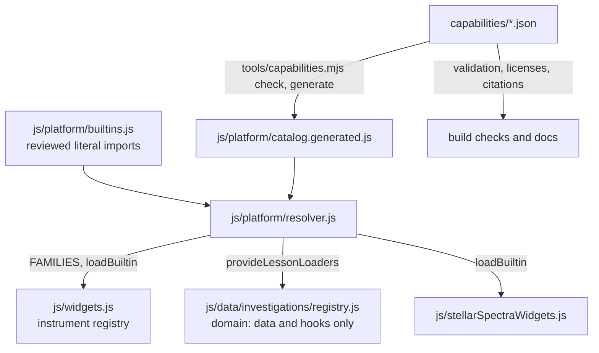

# Platform package RFC and gate

**Status: decided - B (staged).** Carl asked for this gate and the production
prompt after it to run and merge overnight without his review, so the verdict
below was not reviewed before Prompt 09 started from it; it is recorded here as
evidence to be read, not as a decision anybody signed.

This is the architecture and evidence gate for capability packages: which of
Gravitas's capability classes are stable enough to become package boundaries,
a versioned manifest that can describe them, a prototype around three unlike
built-in capabilities, and a verdict judged against thresholds fixed before
the prototype existed. The prototype code stays on
`spike/platform-package-rfc`; this document is the decision record.

## Acceptance thresholds

Fixed before any prototype code existed on the branch, in commit `2b238b8`.
The table and the verdict rules below are verbatim from that commit; only this
section's heading and first paragraph were reworded to sit inside the RFC.
Every result is judged against them as written.

The prototype describes exactly three unlike built-in capabilities with one
manifest format, `gravitas.capability-package/1`:

- **instrument**: the power-law gravity instrument family (`js/powerLawWidgets.js`
  and the model it draws, `js/powerLawGravity.js`, `js/powerLawLab.js`);
- **authentic data**: the SDSS DR18 stellar spectra (`js/data/spectra/` and
  their provenance record);
- **guided investigation**: _What If Gravity Were Not Inverse Square?_
  (`js/data/investigations/power-law-gravity.js`, its Spanish shadow and
  instructor guidance), which depends on the instrument package.

## Thresholds

| #   | Question                                      | Pass when                                                                                                                                                                                                                                                                                                                                |
| --- | --------------------------------------------- | ---------------------------------------------------------------------------------------------------------------------------------------------------------------------------------------------------------------------------------------------------------------------------------------------------------------------------------------- |
| T1  | Can one format describe all three?            | One schema validates all three manifests: identity and version, compatible Gravitas API range, routes, models, widget families, scenarios, investigations, translations, data packs, assets, citations and licenses, offline policy, authoring metadata, validation requirements and migrations - with no field specific to one of them. |
| T2  | Is a declarative package safe?                | The validator rejects every manifest that would make a data or lesson package execute code (a module, entry point, script URL or function anywhere outside a built-in package), and the loader has no path from package content to `import()` of a URL the package names. Both are shown by tests on hostile manifests.                  |
| T3  | Does the validator reject malformed packages? | At least eight distinct malformed manifests are rejected with a message naming the field: missing identity, bad version, incompatible API range, unknown kind, undeclared dependency, dependency cycle, duplicate public id, executable field in a declarative package.                                                                  |
| T4  | Source mode                                   | The three capabilities are found and loaded through their manifests with the site served from the sources, and their existing browser specs pass unchanged.                                                                                                                                                                              |
| T5  | Production build                              | The same with `dist/`: hashed chunk names appear in no manifest, public API, saved state or share link (checked by test), and the specs that run against `dist/` pass.                                                                                                                                                                   |
| T6  | Offline                                       | Every asset the three manifests declare is in the service-worker precache when the precache is generated from them, and the existing offline test for a lazily loaded instrument passes.                                                                                                                                                 |
| T7  | Authoring and validation                      | `author:check` gives the same findings when the investigation is registered from its manifest; each validation requirement a manifest declares resolves to an existing check, and `validation:check` passes.                                                                                                                             |
| T8  | Documentation generation                      | A capability listing generated from the manifests (identity, version, citations, licenses) agrees with what `NOTICE`, `LICENSES.md` and the documented counts say for those three.                                                                                                                                                       |
| T9  | Cost                                          | Start-up bytes and requests unchanged in both configurations; every route within `tools/route-budgets.json`; the deferred total grows by no more than 2.0 KB, inside the untouched 4180 KB ceiling (5.4 KB of headroom at the base) - no budget raised.                                                                                  |
| T10 | Migration                                     | A manifest at version 1 is migrated to a version 2 and back under a declared migration, and old saved work and share links for the investigation still open.                                                                                                                                                                             |

## Verdict rules

- **A (proceed)**: every threshold passes.
- **B (staged)**: T1, T2, T3, T5 and T9 pass, and each other failure has a named,
  bounded production task. The first production slice is exactly these three
  capabilities and what they need, with adapters for everything else.
- **C (stop)**: T2 or T9 cannot be met, or any of the three needs an
  executable escape hatch to be described. The dependent package lane stops
  and the roadmap is revised.
- A threshold that could not be measured is reported as unmeasured and counts
  as not passed.

## The capability classes today

Audited at `c026784`, the green `v2` this gate started from.

| Class                            | How an item is declared                                                                                                 | Public identifier                                                               | Ready to be a package boundary?                                                                                                                               |
| -------------------------------- | ----------------------------------------------------------------------------------------------------------------------- | ------------------------------------------------------------------------------- | ------------------------------------------------------------------------------------------------------------------------------------------------------------- |
| Instrument families              | 13 static imports in `js/widgets.js`, 4 lazy in `LAZY_FAMILIES` (69 widgets)                                            | kebab-case widget ids; saved as `${sid}:tool:${control}`                        | **Yes, after a manifest shape**: the lazy entry is already a small, test-held manifest; control ids are a persisted format without versions                   |
| Science models                   | plain modules (`js/gw/*`, `js/stellar/*`, `js/powerLawGravity.js`)                                                      | module path                                                                     | **Not on their own**: several are shared with start-up; they belong to the package whose instrument uses them                                                 |
| Authentic data                   | generated modules with provenance records and checksums (`js/data/{gw,spectra,stellar}/`)                               | dataset id in the provenance                                                    | **Yes, the most ready**: generated, checksummed, licensed and checked; no schema version yet                                                                  |
| Investigations                   | one file per lesson, a Spanish shadow, hand-written `LOADERS`/`TRANSLATIONS` in `registry.js`                           | kebab-case id, permanent step `sid`                                             | **Yes**: stable ids, `PROGRESS_SCHEMA = 2` with a v1 migration, and the authoring rules. Lessons contain functions, so a lesson package is built-in, not JSON |
| Scenarios                        | `SCENARIO_INFO` plus an `applyPreset` if-chain and cases in `world/build.js`                                            | the English display name, which is also the share-link payload and the i18n key | **No**: renaming one would break saved links; needs an id and an alias map first                                                                              |
| Teaching, evaluation, activities | fixed pages over `js/data/teaching.js`, `activities.js`                                                                 | activity ids and `assignmentId`                                                 | Activities fit as an optional part of a lesson package; the pages stay as they are                                                                            |
| Instructor materials             | one 4,762-line `instructorContent.js`, one encrypted bundle                                                             | lesson id                                                                       | Content should split per lesson into its package; the bundle stays one artifact                                                                               |
| Translations                     | catalog fragments per locale, `catalogLayout`                                                                           | dotted message ids; `gravitas_locale`                                           | **Internal**: the fragment split is a bundling choice                                                                                                         |
| Validation worker                | a front end over `tools/physics-checks.mjs`                                                                             | -                                                                               | Not a boundary; a package's validation requirements name checks                                                                                               |
| Service-worker assets            | a directory walk into `sw-manifest.js`                                                                                  | source paths                                                                    | Generated; would need per-package asset declarations to know whose a file is                                                                                  |
| Share states and saved work      | `shareState.js` (v1), progress (schema 2), backups (v2), experiments (2), notebook (1); the sandbox save has no version | link tags, payload keys, localStorage keys                                      | **Stable public contracts**: packages must never change them, only map their own ids                                                                          |
| Exports                          | `csv.js`, `pdf.js`, `gravitas.submission-results/1`                                                                     | schema ids, column order                                                        | Versioned where it matters; the CSV columns need a schema id before outside readers rely on them                                                              |
| Generated documentation          | `docs-facts`, the manual, the scene catalog                                                                             | -                                                                               | Internal; the listing can be generated from manifests                                                                                                         |

No hashed chunk name appears in any public API, saved state, share link or
export today (searched: `chunk-`, `dist/` and bundle paths in `js/`, `sw.js`,
`index.html`, the service-worker manifest and the build summary). Some code
does rely on source paths being served as they are - the validation page's
worker URL and the `?retry=` re-import - which is private and must stay so.

## The design

### The manifest

One JSON document per package, `gravitas.capability-package` version 1:

```json
{
  "format": "gravitas.capability-package",
  "formatVersion": 1,
  "id": "gravitas.lesson.power-law-gravity",
  "version": "1.0.0",
  "kind": "built-in",
  "gravitas": "^1.0.0",
  "title": { "en": "...", "es": "..." },
  "requires": { "gravitas.power-law-instruments": "^1.0.0" },
  "uses": {
    "scenarios": ["Solar System"],
    "widgets": ["power-law-precession"]
  },
  "provides": {
    "routes": [{ "path": "#investigation=power-law-gravity" }],
    "investigations": [
      {
        "id": "power-law-gravity",
        "entry": "builtin:investigation/power-law-gravity"
      }
    ],
    "translations": [
      {
        "locale": "es",
        "investigation": "power-law-gravity",
        "entry": "builtin:..."
      }
    ]
  },
  "assets": [
    {
      "path": "js/data/investigations/power-law-gravity.js",
      "role": "code",
      "offline": "core"
    }
  ],
  "citations": [],
  "licenses": [
    { "scope": "js/data/investigations/**", "license": "CC-BY-4.0" }
  ],
  "offline": { "policy": "precache" },
  "authoring": { "checks": ["registry:author"] },
  "validation": [{ "check": "e2e:e2e/centralExperiments.spec.js" }],
  "migrations": []
}
```

`provides` covers routes, models, widget families, scenarios, investigations,
translations and data packs; `assets` carries each file's role and offline
class; `citations`, `licenses`, `validation` and `migrations` are what make a
package trustworthy and maintainable. The format version is read strictly: a
build rejects any `formatVersion` it does not know.

### Two kinds, and the security boundary

- **built-in** - reviewed code that ships with Gravitas. It may name code, but
  only as `builtin:<id>`, and an id becomes a module only through
  `js/platform/builtins.js`: reviewed source, one literal `import()` per entry,
  checked by the build against every manifest. No manifest can add an entry.
- **declarative** - content only. The validator rejects any builtin reference,
  code field (`entry`, `pick`, `ready`, `services`), script path, `javascript:`,
  `data:` or remote URL, or code asset anywhere in it. An uploaded package is
  always declarative, and never executes JavaScript. Lessons today contain
  functions, so a declarative lesson needs a JSON-only lesson schema first; that
  is later work, not part of this format's first version.

Hashed chunk names are private. The validator rejects them in any manifest
field, the runtime API takes only package ids, public ids and builtin
references, and the browser proof checks the address and saved work.

### Who owns what



- The **platform** (`js/platform/`, feature layer) owns resolution and loading:
  which package provides an id, what it needs first, and the module behind a
  builtin reference.
- **Domain registries** own content and expose hooks. The lesson registry does
  not import the platform; the platform installs a packaged lesson's loaders
  into it through `provideLessonLoaders()`, so memoizing, translation merging
  and retry are unchanged. The architecture check enforces the direction.
- **Build tools** own validation and generation; the full validator never has
  to run on a visitor's machine for a built-in package.

### Versioning and migration

- **Format version**: the manifest's shape. Readers accept only the versions
  they implement.
- **Package version**: semver. A public id is never reused for something else.
- **Platform API version**: `PLATFORM_API`, `1.0.0` today. A package states the
  range it works with (`"gravitas": "^1.0.0"`); a breaking platform change is a
  major version, and packages that do not accept it are refused with a message.
- **Requirements**: `requires` ranges, checked at build time and resolved at run
  time dependencies-first, with cycles refused.
- **Migrations**: declarative renames of a package's own public ids (controls,
  widgets, steps) keyed on the version range they migrate from, applied to
  saved work on read and reversible - so they need no code of the package's
  own, and a declarative package can carry them too. The stable contracts in
  the table above (link tags, payload keys, storage keys, lesson ids, sids) are
  never renamed by a package.

## Rejected alternatives

- **Reading manifests at run time as JSON.** A request per package, an offline
  entry per manifest, and nothing a bundle could map to its chunks. The build
  reads them and ships a catalog of lookups instead.
- **`import()` of a path or URL a manifest names.** A bundler cannot see it,
  so the production build breaks, and it is an arbitrary-code channel. Code is
  reached only through the reviewed builtin registry.
- **One bundle per package.** Code shared between packages would be
  duplicated in every bundle; esbuild's splitting already gives each package
  its own chunks, and the route budget already measures them.
- **Import maps.** They work for the sources and have no story for the hashed
  build, and they widen what a page will load.
- **Validating built-in manifests on every visit.** The validator is build
  code. Shipping it would spend the deferred budget on checking what the build
  already proved.
- **Shipping the compacted manifests to the browser.** The first prototype did,
  and cost 3.4 KB; direct lookup maps cost a fifth of that.

## What was built, on the spike branch

`capabilities/` holds the three manifests. `js/platform/` holds the schema and
validator, a semver range helper, the builtin registry, the generated catalog,
the resolver, and the lesson installer. `tools/capabilities.mjs` generates the
catalog and checks that the manifests are true of the repository (builtin
references, assets, the precache, validation checks, licenses, citations).
The app loads all three capabilities through the resolver.
`tests/capabilityPackages.test.js` (31 tests) and
`e2e/capabilityPackages.spec.js` (4 tests, both targets) hold the thresholds.

## Measured cost

From fresh builds at `c026784` and the spike, and `node tools/route-budget.mjs`:

|                                  | Base                    | Prototype               |
| -------------------------------- | ----------------------- | ----------------------- |
| Start-up (build)                 | 616.2 KB, 52 files      | 616.2 KB, 52 files      |
| Initial download                 | 816.6 KB                | 816.6 KB                |
| Deferred                         | 4174.6 KB               | 4175.8 KB (**+1.2 KB**) |
| A lesson's first screen, build   | 1623.6 KB, 71 requests  | 1624.7 KB, 71 requests  |
| A lesson's first screen, sources | 4067.9 KB, 159 requests | 4077.0 KB, 164 requests |
| Front door, both configurations  | unchanged               | unchanged               |

By esbuild metafile attribution the +1.2 KB is builtins 0.37, catalog 0.28,
resolver 0.22, lesson installer 0.15, the registry hook 0.14 and chunk glue
0.08. Two lessons from getting there:

- **A builtin entry only for what is loaded by id.** Giving the power-law model
  its own entry split it out of its family's chunk and cost a kilobyte of glue.
- **The source configuration pays per module.** The published site serves each
  platform module separately, comments included: five requests and 9.1 KB more
  on every lesson route, inside the route ceilings but worth folding into fewer
  modules in production.

## Results

| #   | Result                    | Evidence                                                                                                                                                                                                                                                                                         |
| --- | ------------------------- | ------------------------------------------------------------------------------------------------------------------------------------------------------------------------------------------------------------------------------------------------------------------------------------------------ |
| T1  | **Pass**                  | One validator accepts all three and the set; no field is specific to one of them.                                                                                                                                                                                                                |
| T2  | **Pass**                  | Seven hostile declarative manifests rejected (builtin reference, script path, code asset, `javascript:`, remote URL, code hook, `data:` URL); the runtime refuses any reference not in the builtin registry.                                                                                     |
| T3  | **Pass**                  | Eleven malformed cases rejected, each naming its field: missing id, bad version, unknown kind, unknown field, URL asset, chunk name, incompatible API range, undeclared dependency, cycle, duplicate public id, missing or too-old requirement.                                                  |
| T4  | **Pass**                  | Sources: the new spec 4/4; `lazyInstruments` and `stellarSpectra` 8/8; the power-law central experiment.                                                                                                                                                                                         |
| T5  | **Pass**                  | `dist/`: the new spec 3 passed and the offline test skipped as designed; `lazyInstruments` 4 passed, 1 skipped. No chunk name in manifests (validator), the runtime API or saved work and the address (spec).                                                                                    |
| T6  | **Not passed as written** | Every declared asset is in the precache (checked) and a packaged instrument draws offline - but the precache is still a directory walk, not generated from the manifests, and the first offline run failed because the precache had none of the platform's own modules until it was regenerated. |
| T7  | **Pass**                  | Identical authoring findings over all 24 lessons with the packaged lesson swapped in; every declared validation check exists; `validation:check` passes (286 checks).                                                                                                                            |
| T8  | **Pass**                  | The generated listing's citations and licenses match `NOTICE` and `LICENSES.md` (checked by the build tool and a test); documented counts change only by the new tests.                                                                                                                          |
| T9  | **Pass**                  | Start-up and requests unchanged in both configurations; every route within its ceiling; deferred +1.2 KB against a 2.0 limit, inside the untouched 4180.                                                                                                                                         |
| T10 | **Pass**                  | A declared control rename carries saved answers forward and back; the lesson keeps its id, route and progress key, so old saved work and links reach it.                                                                                                                                         |

## Verdict: B, staged

T1, T2, T3, T5 and T9 pass and T6 has one bounded production task, which is the
rule for B. The format describes an instrument, an authentic dataset and a
lesson without an executable escape hatch, costs 1.2 KB, and keeps every
public contract.

## The production slice (Prompt 09)

Exactly these three capabilities and what they need, with adapters for the
rest:

1. **Runtime** - `js/platform/`: the resolver (API range, dependencies with
   cycle detection, deduplicated loads that forget failures), the generated
   catalog, the reviewed builtin registry, and localized, accessible loading and
   error states reusing the instrument panel's (`WidgetLoadError`, Try again,
   Reload). Schema validation at run time is loaded only when a package the
   build did not validate is read, so it costs no route.
2. **Precache from the manifests (T6)** - the service-worker generator takes
   each package's asset classes from its manifest, and the platform's own
   modules are core entries; `sw:check` fails if they disagree.
3. **Build checks** - `node tools/capabilities.mjs check` as a registry entry run
   in CI, and the catalog as a generated file with a staleness check.
4. **Adapters** - every capability without a package stays where it is and is
   treated as core: `uses` references into the core resolve against the core
   catalogs at build time.
5. **Coverage** - contract, migration, malformed-package, cycle, offline and
   source/dist browser tests; before and after route tables; no budget raised.
6. **Fewer source modules** - fold the runtime into as few modules as the
   layering allows, to win back the five source-mode requests.

## Migration backlog, after the first slice

1. The other lazy instrument families (transit, both gravitational-wave
   families), with their lessons.
2. The authentic datasets (GWOSC events, GW150914, MIST tracks) as data
   packages, adding schema versions to their provenance records.
3. The static instrument families, one lesson group at a time.
4. Instructor guidance split per lesson into each lesson package.
5. Scenarios last: they need a stable id and an alias map before a package can
   own one, because today their id is the display name stored in share links.
